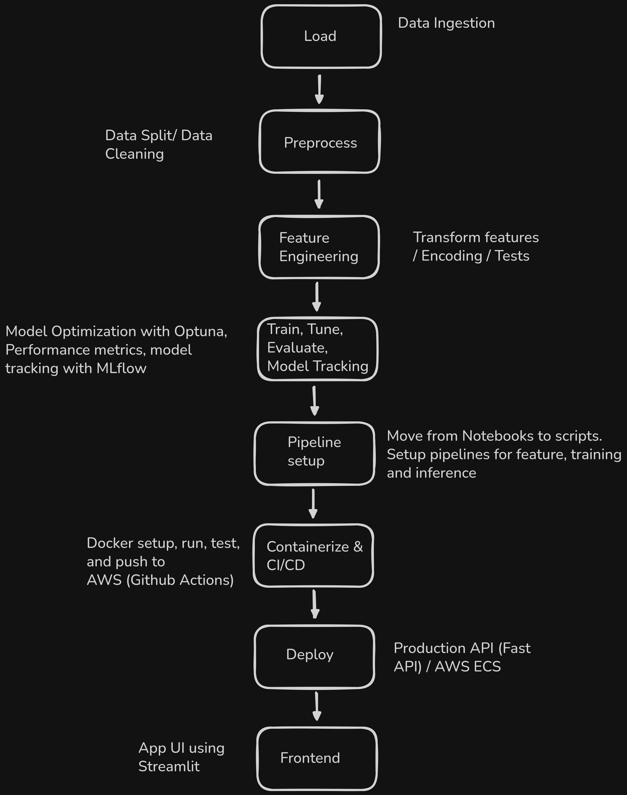

# Weather Forecast Machine Learning Engineering

### Problem Statement
Weather forecast MLE is an end-to-end machine learning pipeline that predicts weather conditions using XGBoost. The project follows ML engineering best practices by utilizing modular pipelines, comprehensive testing, and automated experiment tracking.

### Technology Stack

#### Machine Learning

* XGBoost for regression.
* MLflow for experiment tracking.
* Optuna for hyperparameter tuning.
  
#### Data Processing and Analytics
* Pandas & NumPy for data manipulation and numerical computing.
* Scikit-learn for data preprocessing.
* Pytest for unit testing

#### API and Dashboard
* Streamlit for interactive user interface.
* Plotly for data visualizations.
* FastAPI for REST endpoints.

#### Cloud and Devops
* AWS for using S3, ECS Fargate, ECR, and ALB.
* Docker for containerization.
* GitHub Actions to manage the CI/CD pipeline for automated deployment.

#### ML Engineering Pipeline

