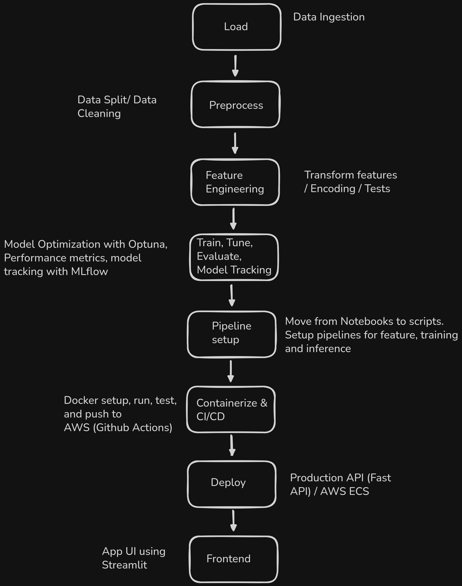

# Weather Forecast MLE

An end-to-end MLOps project that forecasts daily maximum temperature for five German cities using XGBoost, with experiment tracking, a model registry, data validation, drift monitoring, a REST API, an interactive dashboard, and automated CI/CD to AWS ECS.

---

## Architecture



```
Open-Meteo Archive API
        │
        ▼
┌──────────────────────────────────────────┐
│            Feature Pipeline              │
│  load → preprocess → feature_engineering │
│          (Pandera schema validation)     │
└──────────────────────────────────────────┘
        │
        ▼
┌──────────────────────────────────────────┐
│           Training Pipeline              │
│  Lasso baseline + XGBoost (Optuna tuning)│
│  └─ MLflow: experiments + Model Registry │
└──────────────────────────────────────────┘
        │  (Staging → Production)
        ▼
┌─────────────────────┐     ┌────────────────────────┐
│   FastAPI  :8000    │────▶│  Streamlit UI  :8501   │
│  /predict           │     │  (interactive charts)  │
│  /health            │     └────────────────────────┘
│  /metrics  ◀── Evidently drift report
└─────────────────────┘
        │
        ▼                            Nightly cron
Docker → Amazon ECR → ECS  ◀──  GitHub Actions retrain.yml
```

**Cities:** Berlin, Munich, Hamburg, Frankfurt, Cologne  
**Target:** `temperature_2m_max` (daily maximum temperature, °C)

---

## Stack

| Layer | Tool |
|---|---|
| Data ingestion | Open-Meteo Archive API |
| Feature engineering | pandas, scikit-learn |
| Data validation | Pandera (`ProcessedWeatherSchema`) |
| Model training | XGBoost + Lasso baseline |
| Hyperparameter tuning | Optuna |
| Experiment tracking | MLflow |
| Model Registry | MLflow (Staging → Production stages) |
| API validation | Pydantic v2 (`WeatherInput`, `PredictionResponse`) |
| Drift monitoring | Evidently (K-S + chi-square, `/metrics` endpoint) |
| Model serving | FastAPI |
| UI | Streamlit + Plotly |
| Artifact storage | AWS S3 |
| Containerisation | Docker + docker-compose |
| CI/CD | GitHub Actions → ECR → ECS |

---

## Project Structure

```
.
├── pipelines/
│   ├── feature_pipeline/
│   │   ├── load.py               # Open-Meteo API ingestion
│   │   ├── preprocess.py         # cleaning, lag/rolling features
│   │   ├── feature_engineering.py# one-hot encoding, Pandera validation
│   │   └── schemas.py            # ProcessedWeatherSchema (Pandera)
│   ├── training_pipeline/
│   │   ├── train.py              # Lasso baseline → MLflow Registry
│   │   └── tune.py               # XGBoost + Optuna → MLflow Registry
│   ├── inference_pipeline/
│   │   └── inference.py          # full preprocess → predict pipeline
│   └── monitoring_pipeline/
│       └── drift.py              # Evidently drift check, prediction logger
├── tests/                        # pytest unit + integration tests
├── data/
│   ├── raw/                      # train / eval / holdout CSVs
│   └── processed/                # encoded CSVs ready for modelling
├── models/                       # local .pkl fallback (dev only)
├── main.py                       # FastAPI app
├── app.py                        # Streamlit dashboard
├── config.yaml                   # city coords, API config
├── Dockerfile                    # API image
├── Dockerfile.streamlit          # UI image
├── Dockerfile.mlflow             # MLflow tracking server (local dev)
├── docker-compose.yml            # full local stack (mlflow + api + ui)
├── .env.example                  # required environment variables
└── .github/workflows/
    ├── mlops.yml                 # CI: test → build → deploy on push to main
    └── retrain.yml               # nightly retraining + evaluation gate
```

---

## Quickstart

### Prerequisites

- Python 3.12
- [uv](https://docs.astral.sh/uv/) (`pip install uv`)
- AWS credentials with S3 read access (for model artifacts)

### Install

```bash
uv sync
```

### Run the full pipeline locally

```bash
# 1. Ingest raw data and build features
python -m pipelines.feature_pipeline.load
python -m pipelines.feature_pipeline.preprocess
python -m pipelines.feature_pipeline.feature_engineering

# 2. Train and tune (logs to MLflow, registers in Model Registry)
python -m pipelines.training_pipeline.tune

# 3. View experiments
mlflow ui --backend-store-uri sqlite:///mlflow.db
# open http://localhost:5000
```

### Start the API and UI

```bash
# Terminal 1
uvicorn main:app --reload --port 8000

# Terminal 2
streamlit run app.py
```

---

## Local Full-Stack with Docker Compose

Brings up MLflow tracking server, FastAPI, and Streamlit with one command — no AWS credentials required for local development.

```bash
cp .env.example .env.local   # fill in your values (AWS optional for local)
docker-compose up --build
```

| Service | URL |
|---|---|
| MLflow UI | http://localhost:5000 |
| API (Swagger) | http://localhost:8000/docs |
| Streamlit | http://localhost:8501 |

Local volumes are mounted so model artifacts and processed data are read from your working directory without pulling from S3.

---

## API Reference

### `GET /health`

```json
{ "status": "healthy", "model_version": "weather-xgb/v3 (Production)" }
```

### `GET /metrics`

Runs an Evidently drift check comparing the training distribution against recent prediction inputs. Returns per-column K-S / chi-square p-values.

```json
{
  "model_version": "weather-xgb/v3 (Production)",
  "reference_rows": 1755,
  "current_rows": 320,
  "dataset_drifted": false,
  "drifted_column_count": 0,
  "drifted_column_share": 0.0,
  "columns": {
    "temperature_2m_min": { "drift_score": 0.42, "threshold": 0.05, "method": "ks", "drifted": false },
    "precipitation_sum":  { "drift_score": 0.71, "threshold": 0.05, "method": "ks", "drifted": false },
    "weathercode":        { "drift_score": 0.88, "threshold": 0.05, "method": "chisquare", "drifted": false }
  }
}
```

### `POST /predict`

Accepts a JSON array of `WeatherInput` objects. All fields are validated by Pydantic — invalid weathercodes, out-of-range temperatures, or `max < min` are rejected with a `422` before reaching the model.

```bash
curl -X POST http://localhost:8000/predict \
  -H "Content-Type: application/json" \
  -d '[{
    "time": "2024-06-01",
    "city": 1,
    "weathercode": 51,
    "temperature_2m_min": 12.0,
    "temperature_2m_max": 22.5,
    "precipitation_sum": 1.4
  }]'
```

**Response:**

```json
{
  "city": [1],
  "time": ["2024-06-01"],
  "predicted_max_temp": [21.8],
  "actual_max_temp": [22.5],
  "model_version": "weather-xgb/v3 (Production)"
}
```

**`WeatherInput` field constraints:**

| Field | Type | Constraints |
|---|---|---|
| `time` | datetime | ISO 8601 |
| `city` | int | 1–10 |
| `weathercode` | int | WMO codes only |
| `temperature_2m_min` | float | −30 to 45 °C |
| `temperature_2m_max` | float | optional, −30 to 45 °C, must be ≥ min |
| `precipitation_sum` | float | 0–60 mm |

Full schema available at `/docs` (Swagger UI).

---

## MLflow Model Registry

Models are registered automatically at the end of each training run and promoted to **Staging**. Promotion to **Production** happens either manually or via the nightly retraining workflow after the evaluation gate passes.

```python
# Manual promotion
from mlflow.tracking import MlflowClient
client = MlflowClient()
client.transition_model_version_stage(
    name="weather-xgb", version=3, stage="Production"
)
```

At startup, the API loads the **Production** model from the registry, falling back to **Staging**, then to S3, then to local `.pkl` files.

---

## Data Validation

The feature pipeline validates every dataset split against `ProcessedWeatherSchema` (Pandera) before encoding. Validation is lazy — all failing rows and checks are collected before raising, so you see the full picture in one error:

```
[Train] Schema validation failed:
  check                column              failure_case  index
  isin([0,1,2,...])    weathercode         999           42
  ge=-30, le=45        temperature_2m_max  52.1          107
```

---

## Data Leakage Prevention

Splits and features are constructed so nothing from the future reaches training:

- **Chronological splits** — the 360-day ingestion window is split by date, never at random: train = everything up to *T−10 days*, eval = days *T−10…T−5*, holdout = the most recent 5 days (`load.py`).
- **Per-city lag features** — `lag_temp_{1,3,7}d` use `groupby('city').shift()`, so a feature value can only come from that city's own past.
- **Shifted rolling windows** — `rolling_temp_7d_mean/std` are computed with `.rolling(7)…shift(1)`, so a day's target never contributes to its own features.
- **Clean before engineering** — duplicates and rows missing the target are dropped *before* lag/rolling computation, so features are never derived from bad rows.
- **Fit on train only** — the `StandardScaler` is fit on the training split and only applied to eval/holdout; the fitted scaler is persisted next to the model so serving applies the identical transform.

---

## Drift Monitoring

Every call to `/predict` logs the raw input features (`weathercode`, `temperature_2m_min`, `precipitation_sum`) to `data/prediction_log.csv`. The `/metrics` endpoint compares the last 500 logged rows against the training distribution using Evidently:

- **Numerical columns** — Kolmogorov-Smirnov test (p < 0.05 = drift)
- **Categorical columns** — chi-square test (p < 0.05 = drift)
- **Dataset drifted** — true if ≥ 50% of monitored columns show drift

When `dataset_drifted` is true, the nightly retraining workflow can be triggered manually via `workflow_dispatch` to retrain on fresh data.

---

## Cloud Infrastructure & Deployment

| Resource | Name | Purpose |
|---|---|---|
| ECR repositories | `weather-api`, `weather-ui` | Images tagged with commit SHA + `latest` |
| ECS cluster | `weather-cluster-ecs` | Fargate services `weather-api-service` (:8000) and `weather-ui-service` (:8501) |
| S3 bucket | `$S3_BUCKET` | Model and data artifacts |

**S3 bucket layout:**

```
s3://$S3_BUCKET/
├── models/                  # production artifacts — downloaded by the API at startup
│   ├── best_weather_xgb.pkl
│   └── tuned_scaler.pkl
├── processed/               # encoded datasets
└── retrain/<YYYY-MM-DD>/    # nightly archive: that night's model + raw/processed data
```

Containers ship without model weights (`models/` is dockerignored). At startup the API resolves a model in this order: MLflow Registry **Production** → **Staging** → S3 `models/` → local `.pkl` — so shipping a new model never requires rebuilding an image.

**Required GitHub Actions secrets:** `AWS_ACCESS_KEY_ID`, `AWS_SECRET_ACCESS_KEY`, `AWS_REGION`, `S3_BUCKET`, `MLFLOW_TRACKING_URI`

---

## CI/CD

### On push to `main` (`mlops.yml`)

1. Run `pytest tests/` — build is blocked if tests fail
2. Build and push `weather-api` and `weather-ui` images to Amazon ECR
3. Force-redeploy both services on the `weather-cluster-ecs` ECS cluster

### Nightly retraining (`retrain.yml`)

Runs at **02:00 UTC** daily (also triggerable manually via `workflow_dispatch`):

1. Run the full feature pipeline (fresh data from Open-Meteo)
2. Tune XGBoost with Optuna, register new version in MLflow Registry → Staging
3. Evaluate against holdout — if MAE passes threshold, promote to Production
4. Publish the new model to S3 (`models/`) and archive the night's model + data under `retrain/<date>/` for rollback/reproducibility
5. Trigger ECS redeployment — restarted containers download the fresh model from S3 at startup

---

## Common Commands

```bash
# Run the test suite (same gate CI uses before deploying)
pytest tests/ -v

# Train the Lasso baseline
python -m pipelines.training_pipeline.train

# Tune XGBoost with a custom trial budget
python -m pipelines.training_pipeline.tune --n-trials 50

# Batch inference on a raw CSV
python -m pipelines.inference_pipeline.inference \
  --input data/raw/holdout.csv --output data/predictions.csv

# Full local stack (MLflow + API + UI)
docker-compose up --build

# Trigger the nightly retraining manually (requires gh CLI)
gh workflow run retrain.yml -f n_trials=30
```

---

## Key Design Patterns

- **Modular pipelines** — every stage is an independently runnable module (`python -m pipelines.<pipeline>.<step>`); the nightly workflow, tests, and local dev all compose the same building blocks.
- **S3-first model storage** — images contain code only; model weights are pulled at startup, decoupling model releases from image builds.
- **Validation gates at every boundary** — Pandera schemas between pipeline stages, Pydantic at the API edge, and an MAE threshold gate before any model is promoted to Production.
- **Train/serve symmetry** — the fitted scaler and encoding logic are persisted with the model and reapplied verbatim at inference time, so serving sees exactly the transforms training saw.


